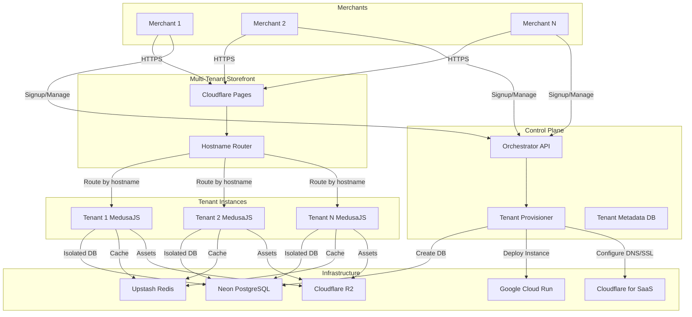

# PRD: Multi-Tenant E-commerce Platform (MedusaJS 2.0)

## Executive Summary

### Problem Statement

Small and medium-sized merchants need a scalable e-commerce platform without managing complex infrastructure. Existing solutions either lack isolation (shared-database multi-tenancy with security risks) or require expensive dedicated servers.

### Proposed Solution

A serverless SaaS e-commerce platform using a multi-instance provisioning model. Each merchant receives a dedicated backend instance with its own database, ensuring complete data isolation while maintaining cost-efficiency through scale-to-zero architecture.

### Key Differentiators

- **True Isolation**: Physical database separation (not just logical)
- **Serverless-First**: All infrastructure scales to zero when idle
- **Rapid Provisioning**: Full store setup in under 2 minutes
- **Cost-Efficient**: Pay only for active resources

### Expected Outcomes

- Enable merchants to launch stores without technical expertise
- Maintain 99.9% uptime with automatic scaling
- Reduce infrastructure costs by 60% compared to always-on instances
- Support thousands of concurrent merchants

---

## 1. Introduction

This project builds a scalable SaaS e-commerce platform similar to Shopify or Nuvemshop. The architecture utilizes a **Multi-Instance (Provisioning) model**, ensuring each merchant has a dedicated backend and database for maximum isolation.

---

## 2. System Architecture

### Architecture Overview



### Component Overview

**Control Plane (Orchestrator)**

- Central API managing tenant provisioning
- Handles merchant signup and store creation
- Manages database and compute resource allocation
- Location: `apps/control-plane/`

**Tenant Instances (Individual Stores)**

- Isolated MedusaJS 2.0 backend instances
- Each tenant has dedicated database and compute
- Serves Store API (`/store`) and Admin Dashboard (`/app`)
- Location: `apps/tenant-instance/` (template)

**Storefront**

- Multi-tenant Next.js application on Cloudflare Pages
- Routes/proxies customer requests to correct tenant backend (NOT simple redirects)
- Serves platform landing page at root domain
- Serves customer-facing store UI
- Location: `apps/storefront/`

---

## 3. User Stories

### US1: Merchant Signup

- **As a**: New merchant
- **I want**: To sign up and get my store provisioned automatically
- **So that**: I can start selling within minutes without technical setup
- **Priority**: P0 (Critical)
- **Acceptance Criteria**:
  - Store fully provisioned in < 2 minutes
  - Unique Neon database created with isolated schema
  - Dedicated Cloud Run instance deployed
  - Admin dashboard accessible immediately
  - Welcome email sent with store URL and credentials
  - Default subdomain assigned (e.g., `merchant-name.platform.com`)

### US2: Store Management

- **As a**: Merchant
- **I want**: An isolated admin dashboard to manage my products, orders, and customers
- **So that**: I can operate my store securely without affecting other merchants
- **Priority**: P0 (Critical)
- **Acceptance Criteria**:
  - Access to MedusaJS admin panel
  - Product catalog management (CRUD operations)
  - Order processing and fulfillment
  - Customer management
  - All data isolated to my tenant database
  - No access to other merchants' data

### US3: Custom Domains

- **As a**: Merchant
- **I want**: To connect my own domain (e.g., `shop.mybrand.com`)
- **So that**: My store reflects my brand identity
- **Priority**: P1 (High)
- **Acceptance Criteria**:
  - DNS configuration instructions provided
  - SSL certificate automatically provisioned via Cloudflare
  - Domain verified and activated within 5 minutes
  - Fallback to subdomain if domain configuration fails
  - Support for both apex and subdomain configurations

### US4: Scaling & Cost Optimization

- **As the**: Platform owner
- **I want**: Idle stores to scale to zero
- **So that**: I minimize compute costs while maintaining instant availability
- **Priority**: P0 (Critical)
- **Acceptance Criteria**:
  - Cloud Run instances configured with `min-instances: 0`
  - Cold start time < 2 seconds
  - Automatic scale-up when traffic arrives
  - Cost tracking per tenant
  - Monitoring alerts for scaling issues

### US5: End Customer Shopping

- **As an**: End customer
- **I want**: To browse products and checkout seamlessly
- **So that**: I can purchase products without technical friction
- **Priority**: P0 (Critical)
- **Acceptance Criteria**:
  - Fast storefront load times (< 1s)
  - Product browsing and search
  - Cart management
  - Checkout flow with payment processing
  - Order confirmation and tracking

---

## 4. Technical Requirements

### 4.1 Backend & Database

**Framework & Language**

- Engine: MedusaJS 2.0+ (Node.js runtime)
- Language: TypeScript (strict mode enabled)
- API: Standard MedusaJS REST/GraphQL endpoints

**Database**

- Provider: Neon Serverless PostgreSQL
- Isolation: One database per tenant (physical separation)
- Provisioning: Automated via Neon API
- Regions: Support multiple regions for data residency
- Backup: Automated daily backups via Neon

**Caching**

- Provider: Upstash Redis (Serverless)
- Use Cases: Session storage, API response caching
- Configuration: Per-tenant Redis namespace

### 4.2 Infrastructure & Networking

**Compute**

- Provider: Google Cloud Run
- Configuration: `min-instances: 0` for scale-to-zero
- Container: MedusaJS application per tenant
- Auto-scaling: Based on request volume
- Cold Start Optimization: Container size < 200MB

**Frontend Hosting**

- Provider: Cloudflare Pages
- Framework: Next.js with edge runtime
- Routing: Hostname-based tenant resolution
- CDN: Global edge caching

**DNS & SSL**

- Provider: Cloudflare for SaaS
- SSL: Automatic certificate provisioning
- Custom Domains: Full support with CNAME configuration
- Wildcard: Subdomain routing for default tenant URLs

**Storage**

- Provider: Cloudflare R2
- Use Cases: Product images, merchant assets
- Access: Per-tenant buckets or namespaced keys
- CDN: Integration with Cloudflare CDN

### 4.3 Non-Functional Requirements

**Performance**

- Store provisioning: < 2 minutes end-to-end
- API response time: p95 < 200ms
- Cold start time: < 2 seconds
- Storefront load time: < 1 second (initial)
- Database query performance: < 50ms (p95)

**Scalability**

- Support 10,000+ concurrent tenants
- Handle 1,000 requests/second per tenant
- Horizontal scaling for Control Plane
- Database connection pooling per tenant

**Security**

- Physical database isolation (no shared databases)
- Authentication: JWT-based with secure token storage
- Authorization: Role-based access control (RBAC)
- Data encryption: At rest and in transit (TLS 1.3)
- Secrets management: GCP Secret Manager
- Audit logging: All admin actions logged
- Compliance: GDPR-ready data handling

**Observability**

- Centralized logging: Structured logs with tenant context
- Metrics: Prometheus-compatible metrics export
- Tracing: Distributed tracing for multi-service calls
- Alerting: Real-time alerts for critical failures
- Dashboards: Per-tenant and platform-wide metrics

**Reliability**

- Uptime target: 99.9% (Service Level Objective)
- Error budget: 43.2 minutes downtime per month
- Backup: Daily automated database backups
- Disaster recovery: Point-in-time recovery (PITR)
- Health checks: Automated endpoint monitoring

### 4.4 API Specifications

**Control Plane API**

```
POST /api/tenants
- Create new tenant
- Request: { merchantEmail, storeName, plan }
- Response: { tenantId, databaseUrl, apiUrl, adminUrl }

GET /api/tenants/:tenantId
- Get tenant details
- Response: { status, databaseUrl, apiUrl, createdAt }

DELETE /api/tenants/:tenantId
- Delete tenant (soft delete)
- Includes database and compute cleanup

POST /api/tenants/:tenantId/domains
- Add custom domain
- Request: { domain }
- Response: { dnsRecords, verificationStatus }

GET /api/tenants/:tenantId/metrics
- Get tenant usage metrics
- Response: { requests, storage, databaseSize }
```

**Tenant API**

- Standard MedusaJS REST API endpoints
- GraphQL API for advanced queries
- Authentication: JWT tokens per tenant
- Rate limiting: 1000 requests/minute per tenant

### 4.5 Data Models

**Tenant Metadata Schema**

```typescript
interface Tenant {
  id: string; // Unique tenant identifier
  merchantEmail: string; // Primary contact
  storeName: string; // Display name
  subdomain: string; // Default subdomain
  customDomains: string[]; // Custom domain list
  databaseUrl: string; // Neon connection string (encrypted)
  apiUrl: string; // Cloud Run endpoint
  status: "provisioning" | "active" | "suspended" | "deleted";
  plan: "free" | "starter" | "professional" | "enterprise";
  createdAt: Date;
  updatedAt: Date;
  metadata: Record<string, any>; // Extensible metadata
}
```

**Tenant Configuration**

```typescript
interface TenantConfig {
  tenantId: string;
  cloudRun: {
    serviceUrl: string;
    region: string;
    minInstances: number; // Always 0 for scale-to-zero
    maxInstances: number;
  };
  database: {
    connectionString: string; // Encrypted
    poolSize: number;
    region: string;
  };
  redis: {
    url: string; // Encrypted
    namespace: string;
  };
  storage: {
    bucketName: string;
    region: string;
  };
}
```

---

## 5. Acceptance Criteria

**AC1: Provisioning Performance**

- A new store instance must be fully live (DB + Compute + DNS) in less than 2 minutes
- Success rate: 99% of provisioning attempts succeed
- Rollback: Failed provisioning automatically cleans up resources

**AC2: Database Isolation**

- Every store must connect to its own unique Neon database
- No shared database connections between tenants
- Connection strings encrypted in secrets manager
- Verification: Audit script confirms isolation

**AC3: Hostname Routing**

- The storefront must resolve the correct merchant API based on incoming hostname or subdomain
- Support for custom domains via Cloudflare for SaaS
- Graceful fallback to error page for unknown domains
- Response time: < 50ms for routing decision

**AC4: Scale-to-Zero**

- Cloud Run services must be configured with `min-instances: 0`
- Instances scale down to zero after 15 minutes of inactivity
- Cold start time remains < 2 seconds
- Cost savings: 60% reduction for idle tenants

**AC5: Security**

- All tenant data physically isolated
- Authentication required for all admin operations
- TLS 1.3 enforced for all connections
- Security audit: Pass penetration testing

**AC6: Monitoring**

- All critical metrics tracked and visualized
- Alerts trigger within 1 minute of incidents
- Provisioning time tracked for every tenant
- Cost per tenant calculated daily

---

## 6. Scope Definition

### In Scope

**Core Platform Features**

- Multi-instance tenant provisioning
- Automated Neon database creation
- Google Cloud Run deployment automation
- Subdomain-based tenant routing
- Custom domain support with SSL
- Scale-to-zero infrastructure
- Basic merchant admin dashboard (MedusaJS)
- Product catalog management
- Order processing
- Basic payment processing

**Infrastructure**

- Control Plane API
- Tenant provisioning automation
- Database provisioning via Neon API
- Cloud Run deployment scripts
- Cloudflare for SaaS integration
- Monitoring and alerting setup

**Security**

- Physical database isolation
- JWT-based authentication
- TLS encryption
- Secrets management

### Out of Scope (Future Phases)

**Advanced Features**

- Advanced analytics dashboard
- Multi-language/internationalization support
- Mobile applications (iOS/Android)
- Advanced payment gateway integrations (beyond basics)
- Marketing automation tools
- Email campaign management
- Advanced inventory management
- Multi-warehouse support

**Infrastructure**

- Multi-region deployments (future optimization)
- Advanced caching strategies (beyond basic Redis)
- Full-text search (Meilisearch - P2)
- Advanced CDN optimization
- Edge compute optimizations

**Business Features**

- Subscription billing management
- Affiliate program support
- Loyalty programs
- Gift cards and vouchers
- Advanced discount rules

---

## 7. MVP Definition

### MVP Scope

The Minimum Viable Product must demonstrate end-to-end tenant provisioning and basic store functionality:

**Core MVP Features**

- Single tenant provisioning flow working end-to-end
- Automated Neon database creation via API
- Basic MedusaJS instance deployed to Cloud Run
- Subdomain routing functional (e.g., `tenant.platform.com`)
- Admin dashboard accessible with authentication
- Product CRUD operations
- Basic storefront with product listing
- Health checks and basic monitoring

**MVP Success Criteria**

- Successfully provision 10 test tenants
- Each tenant has isolated database
- Provisioning completes in < 2 minutes
- Admin dashboard loads in < 2 seconds
- No data leakage between tenants (verified by audit)

**Not in MVP**

- Custom domains (P1 feature)
- Advanced caching strategies
- Full-text search
- Performance optimization (beyond basics)
- Multi-region support
- Advanced monitoring dashboards
- Automated backups (manual backups acceptable)
- Production-grade error handling

### MVP Validation

**Technical Validation**

- Load test: 100 concurrent tenant creations
- Isolation test: Verify database separation
- Performance test: Measure provisioning time
- Security test: Basic penetration testing

**Business Validation**

- 5 beta merchants successfully onboard
- Merchants can manage products and orders
- Feedback collected for P1 features
- Cost per tenant calculated

---

## 8. Risk Assessment

### Risk Analysis

| Risk                                     | Impact   | Probability | Mitigation Strategy                                                                                      |
| ---------------------------------------- | -------- | ----------- | -------------------------------------------------------------------------------------------------------- |
| **Neon API rate limits**                 | High     | Medium      | Implement queue system with retry logic; request rate limit increase; batch operations where possible    |
| **Cloud Run cold starts > 2s**           | Medium   | High        | Optimize container image size (< 200MB); implement container warmup strategy; use prebuilt images        |
| **Custom domain SSL delays**             | High     | Low         | Use Cloudflare SaaS for instant SSL; implement retry mechanism; provide clear status updates             |
| **Database connection leaks**            | High     | Medium      | Implement connection pooling with strict limits; monitor open connections; automatic connection cleanup  |
| **Provisioning failures**                | High     | Medium      | Implement rollback mechanism; retry failed steps; alert on failures; maintain audit log                  |
| **Cross-tenant data leakage**            | Critical | Low         | Strict database isolation; automated isolation testing; code review for all data access; security audits |
| **Cost overruns**                        | High     | Medium      | Implement per-tenant cost tracking; set up budget alerts; optimize resource usage; regular cost reviews  |
| **MedusaJS 2.0 breaking changes**        | Medium   | Low         | Pin to specific version; maintain upgrade testing environment; monitor changelog                         |
| **GCP quotas exceeded**                  | High     | Low         | Monitor quota usage; request quota increases proactively; implement queue for provisioning               |
| **Cloudflare for SaaS setup complexity** | Medium   | Medium      | Thorough documentation; test automation; fallback to subdomain-only if needed                            |

### Risk Monitoring

- Weekly review of provisioning success rate
- Daily monitoring of resource utilization
- Automated alerts for cost anomalies
- Monthly security audits
- Quarterly disaster recovery drills

---

## 9. Dependencies

### External Dependencies

**Third-Party Services**

- **Neon**: Database provisioning API availability, pricing stability, regional availability
- **Google Cloud Run**: Service quotas, cold start performance, pricing model
- **Cloudflare for SaaS**: Custom domain setup, SSL automation, API rate limits
- **MedusaJS 2.0**: Framework stability, plugin ecosystem, migration support
- **Upstash Redis**: Service availability, pricing, performance characteristics

**Technical Dependencies**

- Node.js runtime compatibility (v20+)
- TypeScript toolchain
- Container registry (GCP Artifact Registry)
- DNS propagation timing
- SSL certificate issuance time

### Internal Dependencies

**Development Sequence**

1. Control Plane API must be deployed first (foundation)
2. Tenant template must be tested and validated
3. Infrastructure provisioning scripts must be ready
4. Monitoring stack must be operational
5. Storefront can be developed in parallel

**Team Dependencies**

- Infrastructure team: GCP setup and IAM configuration
- Backend team: Control Plane and tenant template
- Frontend team: Storefront multi-tenant routing
- DevOps team: CI/CD pipeline and monitoring

**Documentation Dependencies**

- API documentation for Control Plane
- Deployment runbooks
- Troubleshooting guides
- Merchant onboarding documentation

---

## 10. Success Metrics

### Key Performance Indicators (KPIs)

**Platform Performance**

- **Provisioning Time**: < 2 minutes (target), < 3 minutes (acceptable)
- **System Uptime**: 99.9% (SLO target)
- **API Response Time**: p95 < 200ms, p99 < 500ms
- **Cold Start Time**: < 2 seconds (target)
- **Storefront Load Time**: < 1 second (first contentful paint)

**Cost Efficiency**

- **Cost per Tenant**: < $5/month for idle tenants
- **Infrastructure Cost Reduction**: 60% savings vs always-on instances
- **Database Costs**: < $10/month per active tenant
- **Compute Costs**: < $15/month per active tenant

**Reliability**

- **Provisioning Success Rate**: > 99%
- **Zero Data Leakage**: 100% isolation maintained
- **Database Uptime**: 99.99% (via Neon SLA)
- **Failed Rollback Rate**: 100% of failed provisions cleaned up

**Business Metrics**

- **Merchant Onboarding Time**: < 10 minutes from signup to first product
- **Merchant Activation Rate**: > 80% of signups create at least one product
- **Customer Satisfaction**: NPS > 50
- **Support Tickets**: < 1 ticket per 10 tenants per month

**Security Metrics**

- **Security Incidents**: 0 cross-tenant data leaks
- **Failed Login Attempts**: Monitored and alerted
- **SSL Certificate Issues**: < 0.1% of custom domains
- **Audit Compliance**: 100% pass rate

### Monitoring Dashboard

**Real-Time Metrics**

- Active tenant count
- Provisioning queue length
- Average provisioning time (rolling 24h)
- API error rate by endpoint
- Database connection pool utilization
- Cost per tenant (updated daily)

**Alerting Thresholds**

- Provisioning time > 3 minutes: Warning
- Provisioning failure rate > 5%: Critical
- API error rate > 1%: Warning
- Cold start time > 3 seconds: Warning
- Database connection pool > 80%: Warning
- Cross-tenant data access attempt: Critical

---

## 11. Monitoring & Observability Strategy

### Logging Strategy

**Structured Logging**

- JSON format with consistent schema
- Include tenant context in every log entry
- Log levels: DEBUG, INFO, WARN, ERROR, CRITICAL
- Retention: 30 days for INFO+, 7 days for DEBUG

**Log Aggregation**

- Centralized logging via Google Cloud Logging or similar
- Per-tenant log filtering capability
- Full-text search across logs
- Log-based metrics extraction

### Metrics Collection

**Infrastructure Metrics**

- Cloud Run: Request count, latency, cold starts, instance count
- Neon: Connection count, query performance, database size
- Redis: Cache hit rate, memory usage, connection count
- Storage: R2 bandwidth, storage size, request count

**Application Metrics**

- Provisioning time breakdown (by step)
- API endpoint performance (per route)
- Error rates by type and tenant
- Database query performance
- Authentication success/failure rates

**Business Metrics**

- Tenant signup rate
- Active tenant count
- Revenue per tenant
- Feature usage statistics

### Tracing

**Distributed Tracing**

- Trace provisioning flow across services
- Track API requests from storefront to tenant backend
- Identify performance bottlenecks
- Correlate errors across service boundaries

### Alerting

**Critical Alerts** (Page on-call)

- Control Plane API down
- Provisioning failure rate > 10%
- Cross-tenant data access attempt
- Database connectivity lost
- SSL certificate expiration < 7 days

**Warning Alerts** (Slack notification)

- Provisioning time > 3 minutes
- API error rate > 1%
- Cold start time > 3 seconds
- Database connection pool > 80%
- Cost anomaly detected (> 20% variance)

**Informational Alerts**

- New tenant provisioned
- Custom domain added
- Tenant suspended/deleted
- Daily cost report

---

## 12. Implementation Priorities

### P0: Core Platform (Must Have)

Critical features required for MVP launch:

- **Control Plane API** with tenant provisioning endpoints
- **Neon database automation** via API integration
- **Cloud Run deployment automation** with scale-to-zero configuration
- **Basic tenant routing** in storefront (subdomain-based)
- **Tenant isolation verification** and audit tooling
- **Authentication** and authorization for admin access
- **Basic monitoring** and health checks
- **Rollback mechanism** for failed provisioning

**Success Criteria**: Single tenant can be provisioned end-to-end in < 2 minutes

### P1: Production Ready (Should Have)

Features needed for production launch:

- **Custom domain support** with DNS configuration
- **SSL automation** via Cloudflare for SaaS
- **Scale-to-zero optimization** and cold start reduction
- **Comprehensive monitoring** and alerting
- **Automated backups** and disaster recovery
- **Security hardening** and penetration testing
- **Performance optimization** (caching, query optimization)
- **Documentation** (API docs, runbooks, merchant guides)

**Success Criteria**: Platform supports 100+ production tenants reliably

### P2: Enhanced Features (Nice to Have)

Features for future phases:

- **Full-text search** (Meilisearch integration)
- **Advanced caching strategies** (edge caching, CDN optimization)
- **Performance optimization** (advanced query optimization, indexing)
- **Multi-region support** for data residency requirements
- **Advanced analytics** dashboard for merchants
- **Automated scaling policies** based on usage patterns
- **Cost optimization** tools for merchants
- **A/B testing framework** for storefront

**Success Criteria**: Platform scales to 1,000+ tenants with improved performance

### P3: Enterprise Features (Future)

Long-term enhancements:

- Multi-language support
- Advanced marketing automation
- Mobile applications
- White-label capabilities
- Advanced integrations (ERP, CRM)
- Machine learning features (recommendations, fraud detection)

---

## 13. Constraints & Non-Negotiables

### Architectural Constraints

**Multi-Instance Only**

- Shared-database multi-tenancy is strictly prohibited
- Each tenant must have physical database isolation
- No logical separation patterns (row-level security, schema per tenant)
- Rationale: Maximum security, compliance, and data sovereignty

**Serverless Priority**

- All infrastructure components must be serverless by default
- Exceptions require explicit justification and approval
- Components: Database (Neon), Redis (Upstash), Compute (Cloud Run), Storage (R2)
- Rationale: Cost efficiency, automatic scaling, reduced operational overhead

**TypeScript Requirement**

- All backend code must be written in TypeScript
- Strict mode enabled in `tsconfig.json`
- No JavaScript files in production code (build scripts excepted)
- Rationale: Type safety, maintainability, developer experience

### Performance Constraints

- Store provisioning: < 2 minutes (hard limit)
- Cold start time: < 2 seconds (target)
- API response time: p95 < 200ms
- Database isolation: 100% (no exceptions)

### Security Constraints

- Physical database isolation (non-negotiable)
- TLS 1.3 required for all connections
- Secrets stored in secure secrets manager
- No sensitive data in logs
- Regular security audits required

---

## Appendix

### Glossary

- **Control Plane**: Central orchestration system managing tenant lifecycle
- **Tenant**: Individual merchant with dedicated infrastructure
- **Multi-Instance**: Architecture where each tenant has separate database and compute
- **Scale-to-Zero**: Automatic shutdown of idle resources to minimize costs
- **Cold Start**: Time to start an idle container from zero instances
- **Provisioning**: Automated process of creating tenant infrastructure
- **Storefront**: Multi-tenant Next.js app that routes/proxies customer requests

### References

- [Architecture Documentation](./docs/ARCHITECTURE.md) - Detailed system architecture and request flows
- [AGENTS.md](./AGENTS.md) - Agent responsibilities and development guidelines
- [MedusaJS Documentation](https://docs.medusajs.com/)
- [Neon API Documentation](https://neon.tech/docs/api)
- [Google Cloud Run Documentation](https://cloud.google.com/run/docs)
- [Cloudflare for SaaS](https://developers.cloudflare.com/cloudflare-for-platforms/cloudflare-for-saas/)

### Document History

- v1.0: Initial PRD created
- v2.0: Comprehensive rewrite with enhanced requirements, architecture, and success metrics
