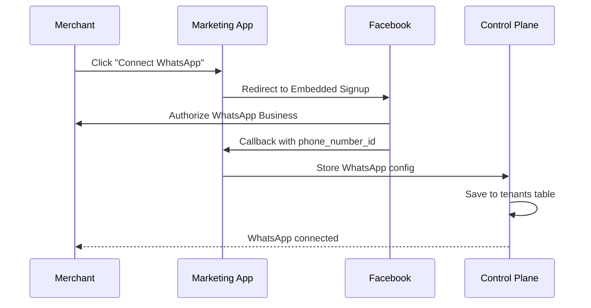
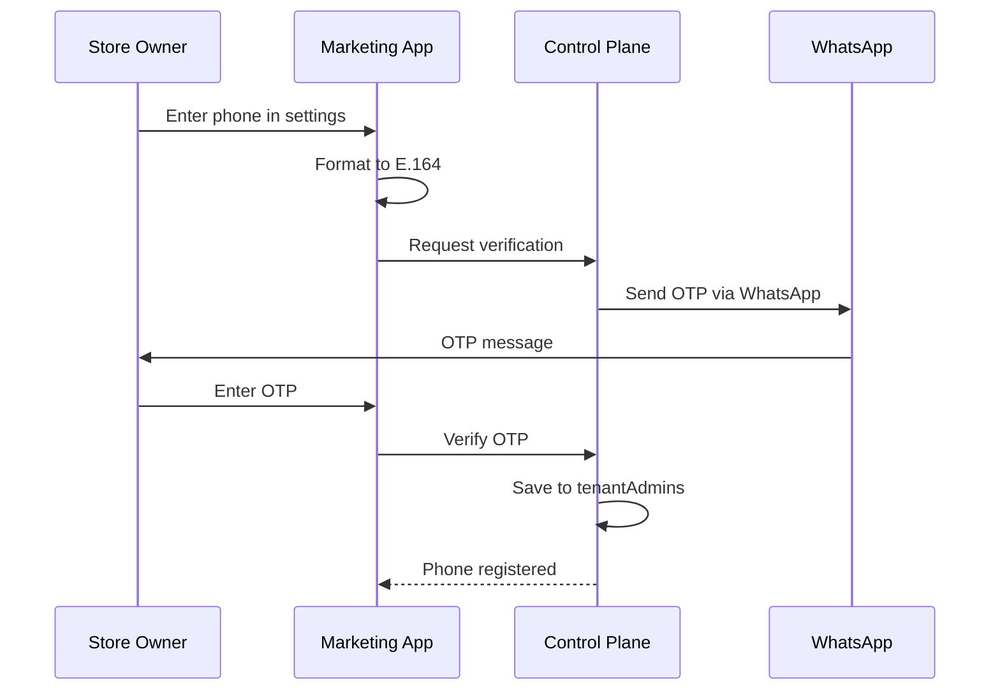

# WhatsApp Integration

**Last Updated**: 2026-02-16

## Overview

The platform supports two WhatsApp channels:

| Channel             | Numbers        | Purpose                            |
| ------------------- | -------------- | ---------------------------------- |
| **Store WhatsApp**  | One per tenant | Customer -> Store conversations    |
| **Vendin WhatsApp** | Single number  | All Store Owners -> Platform admin |

## Number Strategy

```
+----------------------------------------------------------------+
|                    WHATSAPP NUMBERS                            |
+----------------------------------------------------------------+
|                                                                |
|  STORE WHATSAPP (Per-Tenant)                                   |
|  +----------------------------------------------------------+ |
|  |  Moda Brasil     -> +55 11 99991-1111                    | |
|  |  Tech Store      -> +55 11 99992-2222                    | |
|  |  Cafe Aroma      -> +55 11 99993-3333                    | |
|  |  ...more stores                                          | |
|  +----------------------------------------------------------+ |
|                                                                |
|  VENDIN WHATSAPP (Single Number)                               |
|  +----------------------------------------------------------+ |
|  |  All Store Owners -> +1 555-VENDIN                       | |
|  |                                                          | |
|  |  Owner of Moda Brasil    -+                              | |
|  |  Owner of Tech Store     -+-> +1 555-VENDIN              | |
|  |  Owner of Cafe Aroma     -+                              | |
|  +----------------------------------------------------------+ |
|                                                                |
+----------------------------------------------------------------+
```

## Routing Logic

### Flow Diagram

```
                    WhatsApp Webhook
                           |
                           v
              +------------------------+
              |  Extract: to, from     |
              |  Extract: message      |
              +------------+-----------+
                           |
                           v
              +------------------------+
              |  to == VENDIN_WHATSAPP?|
              +------------+-----------+
                     |           |
                    YES          NO
                     |           |
                     v           v
         +-------------+  +-----------------+
         | Admin Flow  |  | Customer Flow   |
         |             |  |                 |
         | Lookup:     |  | Lookup:         |
         | tenant by   |  | tenant by       |
         | admin phone |  | store WhatsApp  |
         | (from)      |  | (to)            |
         |             |  |                 |
         | role=admin  |  | role=customer   |
         +------+------+  +--------+--------+
                |                  |
                +--------+---------+
                         |
                         v
              +------------------------+
              |  Proxy to Tenant       |
              |  Instance via IAM      |
              +------------------------+
```

### Implementation

```typescript
// apps/control-plane/src/domains/webhooks/whatsapp.service.ts

interface WebhookPayload {
  to: string; // Destination phone (E.164)
  from: string; // Sender phone (E.164)
  message: string; // Message text
  messageId: string; // WhatsApp message ID
}

interface RoutingResult {
  tenantId: string;
  role: "admin" | "customer";
  threadId: string;
}

async function routeWhatsAppMessage(
  payload: WebhookPayload,
): Promise<RoutingResult> {
  const VENDIN_WHATSAPP = process.env.VENDIN_WHATSAPP_NUMBER;

  if (payload.to === VENDIN_WHATSAPP) {
    // Admin messaging Vendin - identify by sender phone
    const admin = await db.query.tenantAdmins.findFirst({
      where: eq(tenantAdmins.phone, payload.from),
    });

    if (!admin) {
      throw new Error(`Unregistered admin phone: ${payload.from}`);
    }

    return {
      tenantId: admin.tenantId,
      role: "admin",
      threadId: payload.from,
    };
  } else {
    // Customer messaging store - identify by destination phone
    const tenant = await db.query.tenants.findFirst({
      where: eq(tenants.whatsappPhoneNumber, payload.to),
    });

    if (!tenant) {
      throw new Error(`Unknown store WhatsApp: ${payload.to}`);
    }

    return {
      tenantId: tenant.id,
      role: "customer",
      threadId: payload.from,
    };
  }
}
```

## Database Schema

### Control Plane

```typescript
// apps/control-plane/src/database/schema.ts

export const tenants = sqliteTable("tenants", {
  id: text("id").primaryKey(),
  subdomain: text("subdomain").notNull().unique(),

  // WhatsApp configuration
  whatsappPhoneNumber: text("whatsapp_phone_number").unique(),
  whatsappPhoneId: text("whatsapp_phone_id"), // Meta Phone Number ID
  whatsappProvider: text("whatsapp_provider")
    .$type<"facebook" | "twilio">()
    .default("facebook"),
  whatsappVerifiedAt: integer("whatsapp_verified_at", { mode: "timestamp" }),

  // ... other fields
});

export const tenantAdmins = sqliteTable("tenant_admins", {
  id: text("id").primaryKey(),
  tenantId: text("tenant_id")
    .notNull()
    .references(() => tenants.id, { onDelete: "cascade" }),
  userId: text("user_id").notNull(),
  phone: text("phone").notNull().unique(), // E.164 format
  role: text("role").$type<"owner" | "admin">().default("owner"),
  phoneVerifiedAt: integer("phone_verified_at", { mode: "timestamp" }),
  createdAt: integer("created_at", { mode: "timestamp" }),
});

// Indexes
export const tenantAdminPhoneIdx = index("tenant_admin_phone_idx").on(
  tenantAdmins.phone,
);
export const tenantWhatsappPhoneIdx = index("tenant_whatsapp_phone_idx").on(
  tenants.whatsappPhoneNumber,
);
```

## Webhook Handler

### Control Plane Endpoint

```typescript
// apps/control-plane/src/domains/webhooks/whatsapp.route.ts

import { Hono } from "hono";
import { verifyFacebookSignature, verifyTwilioSignature } from "./signature";
import { routeWhatsAppMessage } from "./whatsapp.service";
import { proxyToTenant } from "../proxy/proxy.service";
import { sendWhatsAppReply } from "./whatsapp-sender";

const app = new Hono();

// Facebook WhatsApp Webhook
app.post("/facebook", async (c) => {
  // 1. Verify signature
  const signature = c.req.header("x-hub-signature-256");
  const body = await c.req.text();

  if (!verifyFacebookSignature(body, signature)) {
    return c.json({ error: "Invalid signature" }, 401);
  }

  // 2. Parse webhook
  const payload = parseFacebookWebhook(JSON.parse(body));

  // 3. Route message
  const routing = await routeWhatsAppMessage(payload);

  // 4. Proxy to tenant instance
  const response = await proxyToTenant(routing.tenantId, "/webhooks/whatsapp", {
    method: "POST",
    body: JSON.stringify({
      from: payload.from,
      message: payload.message,
      role: routing.role,
      threadId: routing.threadId,
    }),
  });

  // 5. Send reply
  await sendWhatsAppReply(payload.from, response.text, routing.tenantId);

  return c.json({ success: true });
});

// Twilio WhatsApp Webhook
app.post("/twilio", async (c) => {
  // Similar flow with Twilio-specific parsing
});

export default app;
```

### Tenant Instance Endpoint

```typescript
// apps/tenant-instance/src/api/webhooks/whatsapp/route.ts

import { MedusaRequest, MedusaResponse } from "@medusajs/framework/http";
import AgentModuleService from "@vendin/medusa-ai-agent";

export async function POST(req: MedusaRequest, res: MedusaResponse) {
  const { from, message, role, threadId } = req.body;

  const agentService = req.scope.resolve(
    "agentModuleService",
  ) as AgentModuleService;

  const response = await agentService.processMessage(threadId, message, {
    role,
    tenantId: process.env.TENANT_ID!,
  });

  return res.json({ text: response });
}
```

## WhatsApp Number Provisioning

### Option A: Meta Embedded Signup (Recommended)

Merchant links their own WhatsApp Business number during onboarding.



### Option B: Vendin Number Pool

Pre-provision numbers and assign during tenant creation.

```typescript
// Number pool management
interface WhatsAppNumberPool {
  phoneNumber: string;
  phoneId: string;
  status: "available" | "assigned" | "reserved";
  assignedTenantId?: string;
}

async function assignNumberToTenant(tenantId: string): Promise<string> {
  const availableNumber = await db.query.whatsappPool.findFirst({
    where: eq(whatsappPool.status, "available"),
  });

  if (!availableNumber) {
    throw new Error("No WhatsApp numbers available");
  }

  await db
    .update(whatsappPool)
    .set({ status: "assigned", assignedTenantId: tenantId })
    .where(eq(whatsappPool.id, availableNumber.id));

  await db
    .update(tenants)
    .set({
      whatsappPhoneNumber: availableNumber.phoneNumber,
      whatsappPhoneId: availableNumber.phoneId,
    })
    .where(eq(tenants.id, tenantId));

  return availableNumber.phoneNumber;
}
```

### Option C: Twilio Subaccounts

Create subaccounts per tenant with number assignment.

```typescript
import Twilio from "twilio";

async function provisionTwilioNumber(tenantId: string): Promise<string> {
  const client = Twilio(MASTER_ACCOUNT_SID, MASTER_AUTH_TOKEN);

  // Create subaccount
  const subaccount = await client.api.v2010.accounts.create({
    friendlyName: `tenant-${tenantId}`,
  });

  // Purchase number
  const number = await client
    .availablePhoneNumbers("US")
    .local.list({ limit: 1 });

  const purchasedNumber = await client.incomingPhoneNumbers.create({
    phoneNumber: number[0].phoneNumber,
    accountSid: subaccount.sid,
    smsUrl: `${CONTROL_PLANE_URL}/webhooks/whatsapp/twilio`,
    voiceUrl: `${CONTROL_PLANE_URL}/webhooks/whatsapp/twilio`,
  });

  return purchasedNumber.phoneNumber;
}
```

## Admin Phone Registration

### Flow



### Implementation

```typescript
// apps/marketing/src/app/api/admin/phone/register/route.ts

export async function POST(req: Request) {
  const session = await getSession();
  const { phone } = await req.json();

  // Validate E.164 format
  if (!isValidE164(phone)) {
    return Response.json({ error: "Invalid phone format" }, { 400 });
  }

  // Check if already registered
  const existing = await controlPlaneClient.tenantAdmins.getByPhone(phone);
  if (existing) {
    return Response.json({ error: "Phone already registered" }, { 400 });
  }

  // Send OTP via WhatsApp
  const otp = generateOTP();
  await whatsappProvider.sendMessage(phone, `Your Vendin verification code: ${otp}`);

  // Store pending verification
  await redis.set(`phone_verification:${phone}`, JSON.stringify({
    otp,
    userId: session.user.id,
    tenantId: session.user.tenantId,
    expiresAt: Date.now() + 5 * 60 * 1000, // 5 minutes
  }), "EX", 300);

  return Response.json({ success: true, message: "OTP sent" });
}

export async function PUT(req: Request) {
  const session = await getSession();
  const { phone, otp } = await req.json();

  // Verify OTP
  const pending = await redis.get(`phone_verification:${phone}`);
  if (!pending || JSON.parse(pending).otp !== otp) {
    return Response.json({ error: "Invalid OTP" }, { 400 });
  }

  // Register admin phone
  await controlPlaneClient.tenantAdmins.create({
    tenantId: session.user.tenantId,
    userId: session.user.id,
    phone,
    role: "owner",
    phoneVerifiedAt: new Date(),
  });

  return Response.json({ success: true });
}
```

## Environment Variables

### Control Plane

```env
# WhatsApp Provider
WHATSAPP_PROVIDER=facebook

# Facebook WhatsApp Business API
FACEBOOK_APP_ID=xxx
FACEBOOK_APP_SECRET=xxx
FACEBOOK_WEBHOOK_VERIFY_TOKEN=xxx

# Vendin Admin WhatsApp
VENDIN_WHATSAPP_NUMBER=+1555VENDIN
VENDIN_WHATSAPP_PHONE_ID=xxx
VENDIN_WHATSAPP_ACCESS_TOKEN=xxx

# Twilio (alternative)
TWILIO_ACCOUNT_SID=xxx
TWILIO_AUTH_TOKEN=xxx
TWILIO_WHATSAPP_FROM=+1555VENDIN
```

### Tenant Instance

```env
# Per-tenant WhatsApp (set during provisioning)
WHATSAPP_PHONE_NUMBER=+551199991111
WHATSAPP_PHONE_ID=xxx
WHATSAPP_ACCESS_TOKEN=xxx
WHATSAPP_PROVIDER=facebook
```

## Security

### Webhook Signature Verification

```typescript
// Facebook
function verifyFacebookSignature(body: string, signature: string): boolean {
  const expected =
    "sha256=" +
    crypto.createHmac("sha256", FACEBOOK_APP_SECRET).update(body).digest("hex");

  return crypto.timingSafeEqual(Buffer.from(signature), Buffer.from(expected));
}

// Twilio
function verifyTwilioSignature(
  url: string,
  params: Record<string, string>,
  signature: string,
): boolean {
  const expected = crypto
    .createHmac("sha1", TWILIO_AUTH_TOKEN)
    .update(
      url +
        Object.entries(params)
          .sort()
          .map(([k, v]) => k + v)
          .join(""),
    )
    .digest("base64");

  return crypto.timingSafeEqual(Buffer.from(signature), Buffer.from(expected));
}
```

### Rate Limiting

```typescript
const rateLimiter = new RateLimiter({
  windowMs: 60 * 1000, // 1 minute
  max: 20, // 20 messages per minute per phone
});

app.use("/webhooks/*", async (c, next) => {
  const phone = extractPhone(c.req);

  if (await rateLimiter.isLimited(phone)) {
    return c.json({ error: "Rate limited" }, 429);
  }

  await next();
});
```
