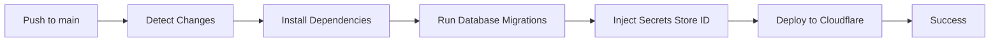

# Control Plane CD Pipeline

**Last Updated**: 2026-01-24  
**Status**: ✅ Active  
**Component**: `apps/control-plane`  
**Workflow**: `.github/workflows/deploy-control-plane.yml`

## Overview

Automated deployment pipeline for the Control Plane application to Cloudflare Workers:

1. **Trigger**: Pushes to `main` affecting:
   - `apps/control-plane/**`
   - Shared packages
   - Root configuration files

2. **Build Process**:
   - Install dependencies using Bun
   - Build/Deploy using `wrangler`

3. **Deployment**:
   - Deploy to Cloudflare Workers
   - Routes: `control.vendin.store/*`

## Required GitHub Secrets

Configure these secrets in GitHub repository settings:

| Secret                        | Description                                                     |
| ----------------------------- | --------------------------------------------------------------- |
| `CLOUDFLARE_API_TOKEN`        | API Token with Workers and Secrets Store (**Edit**) permissions |
| `CLOUDFLARE_ACCOUNT_ID`       | Your Cloudflare Account ID                                      |
| `CLOUDFLARE_SECRETS_STORE_ID` | (Variable) UUID of the Secrets Store                            |

## Local Deployment

### Prerequisites

```bash
# Login to Cloudflare
bun wrangler login
```

### Deploy via Script

```bash
# Using package.json script from root
bun run deploy:control-plane

# Or from apps/control-plane
cd apps/control-plane
bun run deploy
```

## CI/CD Workflow

### Deployment Flow



## Monitoring & Logs

### View Logs

```bash
# Stream logs
cd apps/control-plane
bun wrangler tail
```

## Related Documentation

- [Cloudflare Setup](../setup/CLOUDFLARE_SETUP.md)
- [Control Plane API Development](../../.agent/rules/apps/control-plane/api-development.md)
- [Database Infrastructure](../../.agent/rules/infrastructure/database.md)
