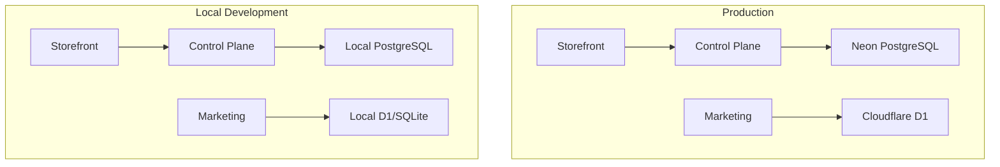

# Local Development Infrastructure Design

## Overview

This document outlines the design for a comprehensive local development infrastructure that enables seamless communication between the three applications in this monorepo: **control-plane**, **marketing**, and **storefront**.

## Current Architecture Analysis

### Application Stack

| Application | Framework | Database | Local Dev Command | Port |
|-------------|-----------|----------|-------------------|------|
| control-plane | Cloudflare Workers (Hono) | PostgreSQL (Neon) | `wrangler dev` | 8787 |
| marketing | Next.js 16 | D1 (SQLite) | `next dev` | 3000 |
| storefront | Next.js 16 | None (stateless) | `next dev` | 3001 |

### Database Technologies



---

## 1. Docker Compose Configuration

The `docker-compose.yml` supports all three applications:

- **PostgreSQL**: For Control Plane and Tenant Instance.
- **Redis**: For caching and sessions.
- **Mailhog**: For email testing.
- **Tenant Instance**: MedusaJS backend.

## 2. Database Seeding Strategy

### Control Plane (PostgreSQL)

Seed script at `apps/control-plane/src/database/seed.ts` creates a test tenant and provisioning events.

Run with:
```bash
pnpm --filter @vendin/control-plane db:seed
```

### Marketing (D1/SQLite)

Seed script at `apps/marketing/src/db/seed.ts` creates a test user and session.

Run with:
```bash
pnpm --filter marketing db:seed
```

### Tenant Instance

Seed script at `apps/tenant-instance/src/scripts/seed.ts` creates default store, region, sales channel, and API key.

Run with:
```bash
pnpm --filter @vendin/tenant-instance db:seed
```

---

## 3. Inter-App Communication Architecture

### Local Development URLs

| Service | URL | Purpose |
|---------|-----|---------|
| Marketing | `http://localhost:3000` | Main landing, auth |
| Storefront | `http://localhost:3001` | Tenant storefront router |
| Control Plane | `http://localhost:8787` | Tenant management API |
| Tenant Instance | `http://localhost:9000` | MedusaJS backend |
| Redis | `localhost:6379` | Caching |
| PostgreSQL | `localhost:5432` | Control plane DB |

### Service Discovery

Shared configuration at `packages/dev-config/local-services.ts`.

---

## 5. Development Workflow

### Prerequisites

1. **Docker Desktop** - For PostgreSQL and Redis
2. **Node.js 20+** - For Next.js applications
3. **pnpm** - Package manager
4. **Wrangler CLI** - For Cloudflare Workers/D1

### Initial Setup

```bash
# 1. Install dependencies
pnpm install

# 2. Start infrastructure services
pnpm dev:infra

# 3. Setup Control Plane database
cd apps/control-plane
pnpm db:generate
pnpm db:migrate
pnpm db:seed

# 4. Setup Marketing database
cd ../marketing
pnpm db:generate
pnpm db:migrate
pnpm db:seed

# 5. Setup Storefront
cd ../storefront
cp .dev.vars.example .dev.vars # if needed
```

### Daily Development

```bash
# Start everything
pnpm dev

# Or start individually
pnpm dev:infra
pnpm --filter @vendin/control-plane dev
pnpm --filter marketing dev
pnpm --filter storefront dev
```

## 7. Troubleshooting Guide

### Common Issues

| Issue | Cause | Solution |
|-------|-------|----------|
| Database connection refused | PostgreSQL not running | `pnpm dev:infra` |
| D1 database not found | Migrations not applied | `wrangler d1 migrations apply marketing-db --local` |
| Tenant resolution fails | Control Plane not running | Start control plane: `pnpm --filter @vendin/control-plane dev` |
| Auth session not persisting | BETTER_AUTH_SECRET mismatch | Ensure same secret in marketing .env |
| CORS errors | Wrong ALLOWED_ORIGINS | Add `http://localhost:3000` to control plane origins |

### Debug Commands

```bash
# Check PostgreSQL connection
docker compose exec postgres psql -U postgres -d main -c "SELECT 1"

# Check Redis connection
docker compose exec redis redis-cli ping

# Reset all databases
pnpm dev:infra:reset
pnpm db:migrate
pnpm db:seed
```
