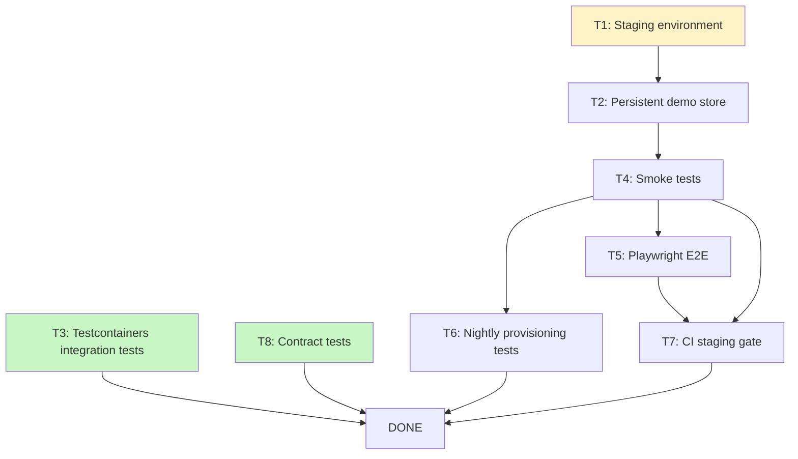

# Test Strategy — Implementation Guide

**Purpose**: Actionable task breakdown for LLMs to implement the strategy in [STRATEGY.md](./STRATEGY.md). Each task includes a ready-to-use prompt, the files the LLM must read first, and explicit acceptance criteria.

---

## Dependency Graph



**Legend**: Green = can start immediately. Yellow = needs infra decision first.

---

## Parallel Execution Groups

Work is batched into waves. All tasks within a wave can be executed concurrently.

| Wave   | Tasks        | Prerequisite             |
| ------ | ------------ | ------------------------ |
| Wave 1 | T3, T8       | None — start immediately |
| Wave 2 | T1           | Infra decision confirmed |
| Wave 3 | T2           | T1 complete              |
| Wave 4 | T4, T5-setup | T2 complete              |
| Wave 5 | T5-tests, T6 | T4 complete              |
| Wave 6 | T7           | T5 + T4 complete         |

---

## Task Prompts

### T3 — Testcontainers Integration Tests

**Can start immediately. No staging dependency.**

**Prompt**:

```
You are working on the control-plane app of a multi-tenant e-commerce platform monorepo.

Read these files first:
- apps/control-plane/tests/utils/mock-database.ts
- apps/control-plane/tests/unit/tenants/tenant.repository.test.ts
- apps/control-plane/tests/unit/tenants/tenant.routes.test.ts
- apps/control-plane/vitest.config.ts
- apps/control-plane/package.json
- docs/test/STRATEGY.md (Layer 2 section)

Goal: Expand integration test coverage using Testcontainers for scenarios that need a real persistent PostgreSQL connection or Redis.

Specific tasks:
1. Add `@testcontainers/postgresql` and `@testcontainers/redis` as devDependencies in apps/control-plane
2. Create apps/control-plane/tests/utils/test-containers.ts — helpers that start/stop real containers per suite
3. Write integration tests for the storefront hostname → tenant resolution path (tests/integration/hostname-resolution.test.ts)
4. Write integration tests for cache hit/miss/expiry behaviour against real Redis (tests/integration/cache.test.ts)
5. Ensure all new tests clean up containers in afterAll hooks

Constraints:
- Keep PGLite for existing repository/service/route tests (it is faster and correct there)
- Testcontainers only for cases PGLite cannot handle (Redis, persistent connections, pg extensions)
- Tests must pass in CI (no Docker socket assumptions — use Testcontainers auto-detection)
- Follow existing test patterns: describe/it/beforeEach/afterAll from vitest globals

Acceptance criteria:
- pnpm --filter @vendin/control-plane test passes with new tests included
- No shared state between test suites
- Container cleanup runs even when tests fail
```

---

### T8 — Contract Tests

**Can start immediately. No staging dependency.**

**Prompt**:

```
You are working on a multi-tenant e-commerce platform monorepo.

Read these files first:
- apps/storefront/src/lib/auth.ts
- apps/control-plane/src/domains/tenants/tenant.routes.ts (find it via glob)
- docs/test/STRATEGY.md (Layer 5 section)

Goal: Add consumer-driven contract tests for the storefront ↔ control-plane interface. The storefront calls the control-plane to resolve hostnames to tenant configs. If this interface breaks silently, the entire storefront stops working.

Specific tasks:
1. Add `@pact-foundation/pact` as a devDependency in apps/storefront
2. Create apps/storefront/tests/contracts/control-plane.pact.test.ts — defines the consumer contract (what the storefront expects from the control-plane)
3. Create apps/control-plane/tests/contracts/storefront-consumer.pact.test.ts — verifies the control-plane satisfies the consumer contract
4. Add pact:verify script to apps/control-plane/package.json
5. Document the contract in docs/test/CONTRACTS.md (what endpoints, what shapes)

Constraints:
- Contract tests run in vitest, not a separate runner
- Pact files generated to .pact/ directory (gitignored)
- No network calls in contract tests — Pact runs a local mock server
- Only cover the hostname resolution endpoint for now

Acceptance criteria:
- Consumer test passes and generates a pact file
- Provider verification test passes against the pact file
- pnpm --filter @vendin/storefront test includes contract tests
```

---

### T1 — Staging Environment

**Prerequisite**: Confirm with team which GCP project to use for staging (separate project vs separate namespace).

**Prompt**:

```
You are setting up a staging environment for a multi-tenant e-commerce platform.

Read these files first:
- .github/workflows/deploy-control-plane.yml
- .github/workflows/deploy-tenant-instance.yml
- .github/workflows/deploy-storefront.yml
- .github/workflows/deploy-marketing.yml
- apps/control-plane/wrangler.jsonc
- apps/storefront/wrangler.jsonc
- gcp/workflows/provision-tenant.yaml
- docs/setup/GCP_INFRASTRUCTURE_SETUP.md
- docs/test/STRATEGY.md (Cloudflare Preview Builds section)

Goal: Create staging deployment workflows and environment config so that:
1. Cloudflare apps (control-plane, storefront, marketing) deploy to preview environments per PR automatically
2. tenant-instance deploys to a dedicated staging Cloud Run service (not the production service)

Specific tasks:
1. Create .github/workflows/deploy-staging.yml — deploys all apps to staging on PR open/sync
   - Uses Cloudflare preview deployments (wrangler deploy --env preview)
   - Deploys tenant-instance to cloud-run-staging service
   - Outputs the preview URLs as job summary
2. Update apps/control-plane/wrangler.jsonc — add [env.preview] section with staging D1 database binding
3. Update apps/storefront/wrangler.jsonc — add [env.preview] section
4. Add STAGING_DATABASE_URL secret to GitHub (document in docs/setup/STAGING_SETUP.md)
5. Create docs/setup/STAGING_SETUP.md — explains how to provision and access the staging environment

Constraints:
- Staging tenant-instance MUST NOT share production Neon databases or Cloud Run service
- Preview Cloudflare deployments must use preview D1 database IDs (separate from production)
- Staging deploy should run on PRs only — not gated on this for merges to main yet (that is T7)

Acceptance criteria:
- Opening a PR triggers staging deploy
- PR comment or job summary shows the preview URLs
- Staging control-plane resolves to staging Cloud Run, not production
```

---

### T2 — Persistent Demo Store

**Prerequisite**: T1 complete (staging environment running).

**Prompt**:

```
You are setting up a persistent demo store in the staging environment of a multi-tenant e-commerce platform.

Read these files first:
- apps/control-plane/src/domains/tenants/tenant.routes.ts (find via glob)
- gcp/workflows/provision-tenant.yaml
- docs/test/STRATEGY.md (Demo Store section)
- docs/setup/STAGING_SETUP.md (created in T1)

Goal: Provision a permanent demo tenant in staging and create a seed script that fills it with realistic data.

Specific tasks:
1. Create scripts/staging/provision-demo-store.ts — calls the staging control-plane API to create a tenant named "demo" with domain "demo-store", waits for provisioning to complete, prints the tenant ID
2. Create scripts/staging/seed-demo-store.ts — connects to the demo store's Neon DB and seeds:
   - 3 product categories
   - 10 products with variants and images
   - 2 customer accounts (customer@demo.com / admin@demo.com)
   - 5 historical orders in various states
3. Add to root package.json: "staging:demo:provision" and "staging:demo:seed" scripts
4. Store the demo tenant ID and URL in a .staging/demo-store.json file (gitignored, but created by the provision script)
5. Document in docs/test/DEMO_STORE.md: how to reset the demo store, credentials, and what data exists

Constraints:
- Scripts must be idempotent — running twice should not create duplicates
- Use the STAGING_CONTROL_PLANE_URL environment variable for the base URL
- Seed data must be realistic (real product names, valid prices, proper status values)
- Scripts must clean up on failure

Acceptance criteria:
- pnpm staging:demo:provision runs without error against the staging environment
- pnpm staging:demo:seed populates the demo store with the specified data
- The demo store storefront URL responds with a 200
- The demo store admin API /health responds with a 200
```

---

### T4 — Post-Deploy Smoke Tests

**Prerequisite**: T2 complete (demo store running in staging).

**Prompt**:

```
You are adding post-deploy smoke tests to a multi-tenant e-commerce platform monorepo.

Read these files first:
- .github/workflows/deploy-control-plane.yml
- .github/workflows/deploy-tenant-instance.yml
- .github/workflows/deploy-storefront.yml
- .staging/demo-store.json (the demo store URL and ID from T2)
- docs/test/STRATEGY.md (Deployment Guarantees section)

Goal: After each deploy, automatically verify critical endpoints respond correctly. If smoke fails, block the deploy (for staging) or trigger rollback (for production).

Specific tasks:
1. Create scripts/smoke/smoke-test.ts — hits these endpoints and asserts responses:
   - GET {CONTROL_PLANE_URL}/health → 200
   - GET {CONTROL_PLANE_URL}/api/tenants → 200, body is array
   - GET {STOREFRONT_URL}/ with Host: demo-store.{DOMAIN} → 200 (tests hostname routing)
   - GET {DEMO_STORE_API_URL}/health → 200
2. Create .github/workflows/smoke-tests.yml — runs smoke-test.ts after staging deploys
3. Update deploy-control-plane.yml — add smoke test job after deploy step (runs against staging)
4. Update deploy-tenant-instance.yml — after production deploy, run smoke and if it fails trigger Cloud Run rollback:
   gcloud run services update-traffic tenant-instance --to-revisions=PREVIOUS=100

Constraints:
- Smoke tests must complete in under 60 seconds
- Must not require authentication for health endpoints
- Rollback command must only run on production deploy, not staging
- Use DEMO_STORE_URL from secrets or .staging/demo-store.json

Acceptance criteria:
- Smoke test script exits 0 when all endpoints respond correctly
- Smoke test script exits 1 with clear error message when any endpoint fails
- Staging deploy fails if smoke tests fail
- Production deploy triggers Cloud Run rollback if smoke fails
```

---

### T5 — Playwright E2E Tests

**Prerequisite**: T4 complete (smoke tests passing, staging confirmed healthy).

**Prompt**:

```
You are adding Playwright end-to-end tests to a multi-tenant e-commerce platform monorepo.

Read these files first:
- apps/marketing/src/app/ (sign up flow pages)
- apps/storefront/src/ (routing and page structure)
- docs/test/DEMO_STORE.md (demo store credentials and URLs from T2)
- docs/test/STRATEGY.md (Layer 3 section)
- packages/config/vitest.base.ts

Goal: Create Playwright E2E tests that run against the persistent demo store in staging, covering the critical user paths.

Specific tasks:
1. Create tests/e2e/ at the monorepo root with playwright.config.ts
   - baseURL from E2E_BASE_URL environment variable
   - 2 workers, retries: 1 in CI
2. Install Playwright: pnpm add -D @playwright/test -w
3. Write tests/e2e/merchant/signup.spec.ts — test merchant signup flow on marketing site
4. Write tests/e2e/merchant/dashboard.spec.ts — test merchant login and product creation
5. Write tests/e2e/storefront/browse.spec.ts — test customer browsing the demo store (hostname routing)
6. Write tests/e2e/storefront/checkout.spec.ts — test customer add-to-cart and checkout
7. Add "test:e2e" script to root package.json
8. Update .github/workflows/deploy-staging.yml — run E2E after staging deploy succeeds

Constraints:
- E2E tests must use the demo store credentials from DEMO_STORE_* environment variables (not hardcoded)
- Tests must clean up any data they create (e.g., delete test orders after checkout test)
- Each test file must be runnable independently
- No E2E tests in the per-app test suites — all E2E lives in tests/e2e/ at root
- Target: full suite under 15 minutes

Acceptance criteria:
- pnpm test:e2e passes against staging environment
- All 4 test files contain working tests
- Tests run in CI after staging deploy
- Test results are uploaded as GitHub Actions artifacts
```

---

### T6 — Nightly Provisioning Tests

**Prerequisite**: T4 complete (smoke tests can verify the provisioned store).

**Prompt**:

```
You are adding nightly provisioning tests to a multi-tenant e-commerce platform monorepo.

Read these files first:
- gcp/workflows/provision-tenant.yaml
- apps/control-plane/src/domains/tenants/tenant.routes.ts (find via glob)
- scripts/smoke/smoke-test.ts (from T4)
- docs/test/STRATEGY.md (Layer 4 and Ephemeral Store sections)

Goal: Create a nightly test that provisions a real tenant from scratch via the staging control-plane, verifies it works, then tears it down completely.

Specific tasks:
1. Create scripts/staging/test-provisioning.ts — full lifecycle test:
   a. POST /api/tenants to staging control-plane (name: "nightly-test", domain: "nightly-TIMESTAMP")
   b. Poll tenant status until "active" or timeout at 10 minutes
   c. Run smoke checks against the provisioned tenant (health + store API)
   d. Intentionally trigger a bad deploy to test rollback (if a rollback test endpoint exists)
   e. DELETE /api/tenants/{id} to deprovision
   f. Verify cleanup: Neon DB gone, Cloud Run revision gone
   g. Exit 0 on success, exit 1 with full log on any failure

2. Create .github/workflows/nightly-provisioning.yml:
   - Schedule: cron '0 2 * * *' (2am UTC)
   - Run test-provisioning.ts against staging
   - On failure: create a GitHub issue with the failure log
   - Always run cleanup even if test fails (use a finally step)

Constraints:
- The provisioning test MUST clean up all resources even if it fails — leaked Cloud Run + Neon costs money
- Use unique domain names with timestamps to avoid conflicts
- Timeout the entire workflow at 20 minutes
- Never run against production

Acceptance criteria:
- Script completes full provision → verify → deprovision lifecycle
- Script creates a GitHub issue on failure (test the failure path manually)
- All GCP and Neon resources are cleaned up after the run
- nightly-provisioning.yml triggers on schedule and can also be triggered manually (workflow_dispatch)
```

---

### T7 — CI Staging Gate

**Prerequisite**: T4 (smoke tests) and T5 (E2E tests) both complete and passing.

**Prompt**:

```
You are updating the CI/CD pipeline of a multi-tenant e-commerce platform monorepo to gate production deploys on staging validation.

Read these files first:
- .github/workflows/ci.yml
- .github/workflows/deploy-control-plane.yml
- .github/workflows/deploy-tenant-instance.yml
- .github/workflows/deploy-storefront.yml
- .github/workflows/deploy-marketing.yml
- .github/workflows/deploy-staging.yml (from T1)
- .github/workflows/smoke-tests.yml (from T4)
- docs/test/STRATEGY.md (Target Pipeline section)

Goal: Production deploys must only run after staging smoke tests and E2E tests have passed for the same commit.

Specific tasks:
1. Update all deploy-*.yml workflows — add `needs: [smoke-tests, e2e-tests]` to production deploy jobs
2. Update deploy-tenant-instance.yml — add Cloud Run traffic splitting:
   - Deploy new revision with --no-traffic
   - Route 10% traffic to new revision for 5 minutes
   - If error rate > 1%: roll back to previous revision
   - If healthy: promote to 100%
3. Create .github/workflows/production-gate.yml — a reusable workflow that other deploy workflows call. It:
   - Runs smoke tests against staging
   - Waits for E2E results
   - Only signals success if both pass
4. Update docs/test/STRATEGY.md to mark the pipeline as implemented (change "In Planning" to "Active")

Constraints:
- Manual deploy via workflow_dispatch must still be possible but must warn if skipping staging gate
- The gate must not add more than 20 minutes to the total deploy time
- Rollback must not require manual intervention

Acceptance criteria:
- Pushing to main with a broken smoke test blocks production deploy
- Pushing to main with passing tests deploys to production automatically
- Cloud Run traffic splitting is observable in GCP console
- workflow_dispatch with skip_gate: true is available for emergency deploys (with audit log warning)
```

---

## Skills Reference

The following Claude skills implement this strategy. Use them by asking Claude to perform the specific task:

| Skill                          | Trigger phrase                                                             | Tasks |
| ------------------------------ | -------------------------------------------------------------------------- | ----- |
| `implement-integration-tests`  | "add Testcontainers integration tests", "expand integration test coverage" | T3    |
| `setup-demo-store`             | "provision demo store", "set up staging demo store"                        | T2    |
| `implement-e2e-tests`          | "add Playwright E2E tests", "write end-to-end tests"                       | T5    |
| `implement-smoke-tests`        | "add smoke tests", "add post-deploy verification"                          | T4    |
| `implement-provisioning-tests` | "add provisioning tests", "test tenant lifecycle"                          | T6    |

See `.agent/skills/shared/` for the full skill definitions.
